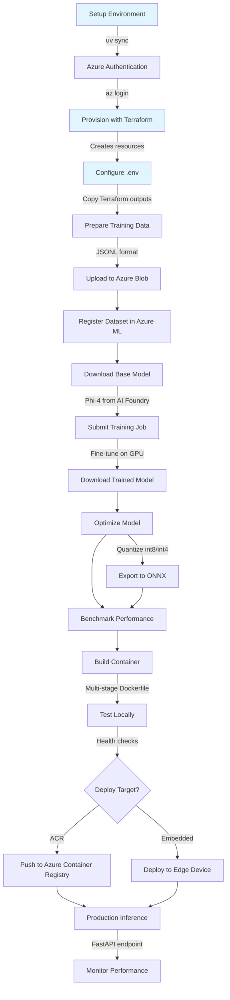

# SLM Training and Deployment System

Train small language models (SLMs) using Azure ML and deploy them as highly optimized containers for embedded hardware.


## Workflow Overview



## Overview

This project provides an end-to-end system for:

- Training small language models on Azure ML with GPU acceleration
- Downloading pre-trained models from Azure AI Foundry
- Optimizing models with quantization (int8/int4) and ONNX conversion
- Building minimal container images (<500MB) for embedded deployment
- Deploying to local environments and embedded Linux devices

**Target Use Case**: Deploy AI models to resource-constrained embedded hardware with <4GB RAM, CPU-only inference, and <50ms latency requirements.

## Features

✅ **Azure ML Integration**: Provision infrastructure and submit training jobs with Terraform and Azure ML SDK
✅ **AI Foundry Models**: Download Phi-4 mini and other models from Azure AI Foundry catalog
✅ **LoRA Fine-tuning**: Efficient parameter-efficient fine-tuning with PEFT
✅ **Model Optimization**: Post-training quantization (int8/int4) and ONNX export
✅ **Multi-architecture**: Build ARM64 and x86_64 containers
✅ **Embedded Deployment**: systemd services, health monitoring, rollback procedures
✅ **Jupyter Orchestration**: Step-by-step notebooks for the entire workflow

## Prerequisites

- [Azure CLI](https://docs.microsoft.com/en-us/cli/azure/install-azure-cli) installed and configured
- [Azure Developer CLI (azd)](https://learn.microsoft.com/en-us/azure/developer/azure-developer-cli/install-azd) for infrastructure deployment
- [Terraform](https://www.terraform.io/downloads) >= 1.6
- [Python 3.11+](https://www.python.org/downloads/)
- [uv](https://docs.astral.sh/uv/) - Ultra-fast Python package manager
- [Docker](https://docs.docker.com/get-docker/) for container builds
- Azure subscription with sufficient GPU quota for training
- Existing Azure Resource Group (create with: `az group create --name <rg-name> --location eastus`)

## Quick Start

### 1. Clone and Setup Environment

```bash
# Clone the repository
git clone <repo-url>
cd slm-train-deploy-container

# Install uv (if not already installed)
curl -LsSf https://astral.sh/uv/install.sh | sh

# Setup Python environment and install dependencies
uv sync
```

### 2. Authenticate with Azure

```bash
# Login to Azure
az login
az account set --subscription <your-subscription-id>
```

### 3. Provision Azure Infrastructure with Azure Developer CLI

```bash
# Run the interactive setup script (recommended)
./scripts/setup-azd.sh

# The script will:
#   - Verify prerequisites (azd, Azure CLI)
#   - Create or select an azd environment
#   - Prompt for required configuration (resource group, location)
#   - Configure naming (prefix/suffix for terraform-azurerm-naming module)
#   - Set all environment variables for Terraform

# After setup, deploy infrastructure
azd up

# Or just provision without deployment
azd provision
```

**Alternative: Direct Terraform Deployment**

If you prefer to use Terraform directly without azd:

```bash
# Navigate to Terraform directory
cd infra/terraform

# Initialize Terraform
terraform init

# Review and customize dev.tfvars
# Update resource names (storage account, ACR, workspace) as needed
# Apply configuration (dev environment)
terraform apply -var-file=environments/dev.tfvars

# Note the output values - you'll need these for the next step
# Return to project root
cd ../..
```

### 4. Configure Environment Variables (After Provisioning)

**Important**: Run this step AFTER `azd up` or `azd provision` completes. The `.env` file should contain actual resource names created by Terraform, not input values.

```bash
# If using azd, export Terraform outputs to .env
azd env get-values > .env

# If using Terraform directly, copy template and fill in values
cp .env.template .env

# Edit .env and populate with values from Terraform outputs:
#   - AZURE_SUBSCRIPTION_ID (your subscription)
#   - AZURE_TENANT_ID (your tenant)
#   - AZURE_RESOURCE_GROUP (from Terraform)
#   - AZURE_LOCATION (from Terraform, e.g., eastus)
#   - AZUREML_WORKSPACE_NAME (from Terraform output: workspace_name)
#   - AZURE_STORAGE_ACCOUNT_NAME (from Terraform output: storage_account_name)
#   - AZURE_CONTAINER_REGISTRY_NAME (from Terraform output: acr_name)
```

**Note**: The `.env` file contains the actual resource names created by Terraform. These may differ from input names if Terraform applies transformations or adds suffixes for uniqueness.

### 5. Prepare Training Data

Place your training data in JSONL format at `data/training_data.jsonl`:

```jsonl
{"prompt": "Translate to French: Hello", "completion": "Bonjour"}
{"prompt": "What is AI?", "completion": "Artificial Intelligence is..."}
```

**Quick Start with Example Data:**

```bash
# Option 1: Use the setup script (recommended)
./scripts/setup_training_data.sh

# Option 2: Manual copy
cp data/training_data.jsonl.example data/training_data.jsonl
```

**Requirements:**

- Each line must be valid JSON
- Required fields: `prompt` and `completion` (both non-empty strings)
- Recommended: 100+ samples for meaningful fine-tuning
- Maximum prompt length: 2048 tokens (configurable in `configs/data_config.yaml`)
- Maximum completion length: 1024 tokens (configurable)

See `data/README.md` for detailed format requirements and examples.

### 6. Run Training Workflow

Start Jupyter and execute notebooks in sequence:

```bash
# Start Jupyter Lab
uv run jupyter lab

# Or Jupyter Notebook
uv run jupyter notebook
```

Execute the notebooks in this order:

1. `notebooks/01-setup-infrastructure.ipynb` - Verify Azure resources
2. `notebooks/02-prepare-data.ipynb` - Prepare and upload training data
3. `notebooks/03-provision-compute.ipynb` - Provision GPU compute cluster
4. `notebooks/04-download-model.ipynb` - Download base model from AI Foundry
5. `notebooks/05-train-model.ipynb` - Test training pipeline locally
6. `notebooks/06-submit-training-job.ipynb` - Submit training job to Azure ML
7. `notebooks/07-download-trained-model.ipynb` - Retrieve trained checkpoints & registry model
8. `notebooks/08-optimize-model.ipynb` - Quantize (int8/int4) & export ONNX, benchmark
9. `notebooks/09-evaluate-model.ipynb` - Evaluate optimized vs baseline metrics
10. `notebooks/10-build-container.ipynb` - Build optimized container image (<500MB)
11. `notebooks/11-push-to-acr.ipynb` - Push to Azure Container Registry
12. `notebooks/12-deploy-inference.ipynb` - Deploy locally or to embedded device

## Usage Guide

### Running Inference Locally (Without Container)

Scoring script: `src/inference/scoring.py`

- `init(model_dir, onnx_path, use_onnx)` loads quantized HF or ONNX model.
- `run({"prompt": str, "max_new_tokens": int})` returns JSON with output & latency.
- Designed for CPU-only execution (<4GB RAM) with lazy initialization.

FastAPI server: `src/inference/server.py`

- Endpoints: `GET /health`, `POST /generate`.
- Environment vars: `MODEL_DIR`, `ONNX_PATH`, `USE_ONNX`, `PORT`.
- Run locally:

```bash
uv run python -m src.inference.server
curl -X POST http://localhost:8080/generate -H 'Content-Type: application/json' \
	-d '{"prompt": "Hello", "max_new_tokens": 16}'
```

### Building and Running Container

Multi-stage Dockerfile at `docker/Dockerfile` packages the optimized model with inference code.

**Build:**

```bash
# Build the container image
docker build -t slm-inference:latest -f docker/Dockerfile .
```

**Run locally:**

```bash
# Run with PyTorch model (default)
docker run --rm -p 8080:8080 slm-inference:latest

# Run with ONNX backend (faster, smaller)
docker run --rm -e USE_ONNX=true -p 8080:8080 slm-inference:latest

# Test the endpoint
curl -X POST http://localhost:8080/generate \
  -H 'Content-Type: application/json' \
  -d '{"prompt": "Hello, how are you?", "max_new_tokens": 16}'
```

### Pushing to Azure Container Registry

Prerequisites: Authenticated with Azure (`az login`) and ACR created.

```bash
# Set your ACR name
export ACR_NAME=<your_acr_name>

# Authenticate Docker to ACR
az acr login --name $ACR_NAME

# Tag and push the image
docker tag slm-inference:latest $ACR_NAME.azurecr.io/slm-inference:latest
docker push $ACR_NAME.azurecr.io/slm-inference:latest

# Or use the automated script
./scripts/push_to_acr.sh

# Verify the image
az acr repository show-tags --name "$ACR_NAME" --repository slm-inference
```

### Multi-Architecture Builds (ARM64 + x86_64)

For embedded hardware supporting different architectures:

```bash
# Build for both ARM64 and x86_64
./scripts/build_multiarch.sh

# This creates platform-specific images for deployment flexibility
```

### Health Monitoring

Check container health and measure response latency:

```bash
# Run health check script
./scripts/health_check.sh

# Or manual check
curl http://localhost:8080/health
```

### Performance Monitoring

The `src/monitoring/metrics_collector.py` module provides utilities for tracking:

- Request latency (percentiles: p50, p95, p99)
- System resource usage (CPU, memory)
- Request throughput

Integrate these into your inference pipeline for production monitoring.

## Project Structure

```
slm-train-deploy-container/
├── infra/                  # Infrastructure as Code (Terraform)
├── notebooks/              # Jupyter notebooks for orchestration
├── src/                    # Source code modules
│   ├── data/              # Data preprocessing and upload
│   ├── training/          # Training scripts
│   ├── evaluation/        # Model evaluation
│   ├── inference/         # Inference server
│   └── utils/             # Shared utilities
├── configs/               # Configuration files
├── docker/                # Container definitions
├── tests/                 # Test suite
└── scripts/               # Utility scripts
```

## Azure Developer CLI (azd) Integration

This project supports deployment via Azure Developer CLI (azd) for streamlined infrastructure management.

### Why Use azd?

- **Simplified Deployment**: Single `azd up` command provisions all infrastructure
- **Environment Management**: Easy switching between dev/staging/prod environments
- **Integrated Workflow**: Combines infrastructure (Terraform) with application deployment
- **State Management**: Automatic handling of deployment state per environment

### azd Setup

```bash
# Run the interactive setup script
./scripts/setup-azd.sh
```

The script will:

1. Check for azd and Azure CLI installation
2. Create or select an azd environment
3. Prompt for required configuration:
   - Resource group name (must exist or will be created)
   - Azure location (e.g., eastus)
   - Environment name (e.g., dev, prod)
4. **Configure naming with terraform-azurerm-naming module**:
   - Uses environment name as suffix
   - Terraform automatically generates consistent names:
     - Storage account: `st-{suffix}` with unique hash (e.g., `st-dev-a1b2c3d4`)
     - Container registry: `acr-{suffix}` with unique hash (e.g., `acr-dev-a1b2c3d4`)
     - ML workspace: `mlw-{suffix}` (e.g., `mlw-dev`)
5. Set all Terraform input variables (TF*VAR*\* prefix)

**After provisioning**, export Terraform outputs:

```bash
azd env get-values > .env
```

### azd Commands

```bash
# Deploy everything (infrastructure + app)
azd up

# Provision infrastructure only
azd provision

# View environment configuration
azd env get-values

# Export configuration to .env file
azd env get-values > .env

# Switch environments
azd env select <environment-name>

# Create new environment
azd env new <environment-name>

# Tear down all resources
azd down

# View logs and monitoring
azd monitor
```

### Environment Configuration

Required Terraform input variables (set via `setup-azd.sh` with TF*VAR* prefix):

| Variable                    | Description                                  | Example                                |
| --------------------------- | -------------------------------------------- | -------------------------------------- |
| `AZURE_SUBSCRIPTION_ID`     | Azure subscription ID                        | `00000000-0000-0000-0000-000000000000` |
| `AZURE_RESOURCE_GROUP_NAME` | Existing resource group                      | `rg-slm-training-dev`                  |
| `AZURE_LOCATION`            | Azure region                                 | `eastus`                               |
| `TF_VAR_suffix`             | Resource name suffix (typically environment) | `["dev"]` or `["prod"]`                |
| `TF_VAR_acr_sku`            | Container registry SKU                       | `Basic`, `Standard`, or `Premium`      |
| `TF_VAR_compute_vm_size`    | VM size for training                         | `Standard_NC6s_v3`                     |

**Note**: The `terraform-azurerm-naming` module automatically generates globally unique resource names using the suffix (environment name). Storage accounts and container registries include a unique hash to ensure global uniqueness.

### azd Hooks

The `azure.yaml` configuration includes lifecycle hooks:

**Pre-provision**: Validates configuration and resource group existence
**Post-provision**: Displays next steps and output values

### Managing Multiple Environments

```bash
# Create dev environment
azd env new dev
./scripts/setup-azd.sh  # Configure with dev settings
azd up

# Create prod environment
azd env new prod
./scripts/setup-azd.sh  # Configure with prod settings
azd up

# Switch between them
azd env select dev
azd env select prod
```

### Troubleshooting azd

**Issue**: `azd: command not found`

```bash
# Install azd
curl -fsSL https://aka.ms/install-azd.sh | bash
```

**Issue**: Resource group doesn't exist

```bash
# Create it first
az group create --name <rg-name> --location eastus
# Then run azd setup again
./scripts/setup-azd.sh
```

**Issue**: Name conflicts (storage/ACR already taken)

```bash
# The terraform-azurerm-naming module handles uniqueness automatically
# If conflicts occur, use different prefix/suffix values
azd env set TF_VAR_prefix '["myproject"]'
azd env set TF_VAR_suffix '["prod"]'
azd provision
```

For more details, see [infra/terraform/README.azd.md](infra/terraform/README.azd.md).

## Performance Targets

- **Training**: Complete fine-tuning in <2 hours on single GPU
- **Container Size**: <500MB (embedded optimized)
- **Inference Latency**: P95 <50ms on CPU
- **Startup Time**: <10 seconds cold start
- **Memory Usage**: <4GB RAM during inference

## Development

### Running Tests

```bash
# Run all tests
uv run pytest

# Run with coverage
uv run pytest --cov=src --cov-report=html

# Run specific test categories
uv run pytest tests/unit/          # Unit tests only
uv run pytest tests/integration/   # Integration tests only
```

### Code Quality

```bash
# Format code
uv run black src tests

# Lint code
uv run ruff check src tests

# Type checking
uv run mypy src

# Run all quality checks
uv run black src tests && uv run ruff check src tests && uv run mypy src
```

### CI/CD Pipeline

GitHub Actions workflow at `.github/workflows/ci.yml` runs on every commit:

- Code formatting checks (black)
- Linting (ruff)
- Unit and integration tests
- Multi-architecture container builds

The workflow ensures code quality and build reliability before deployment.

## Documentation

- [Specification](.specify/specs/slm-train-deploy-system.md) - Detailed feature specification
- [Implementation Plan](.specify/plans/slm-train-deploy-system.md) - Technical implementation plan
- [Tasks](.specify/tasks/slm-train-deploy-system.md) - Task breakdown
- [Constitution](.github/prompts/constitution.md) - Project principles and standards

## Troubleshooting

### Common Issues

**GPU Quota Errors:**

- Request quota increase in Azure Portal: Subscriptions → Usage + quotas
- Or use CPU-only training (slower) by modifying compute configuration

**Authentication Errors:**

- Ensure `az login` is successful
- Verify `.env` has correct subscription ID and tenant ID
- Check RBAC permissions for storage account and ACR

**Model Download Failures:**

- Verify network connectivity to Azure AI Foundry
- Check workspace permissions for model registry access
- Use notebook `04-download-model.ipynb` for detailed logs

**Container Build Failures:**

- Ensure sufficient disk space (>10GB for model + layers)
- Verify Docker daemon is running
- Check model files exist in expected paths

**Inference Latency Issues:**

- Use ONNX backend for faster CPU inference
- Ensure quantized model (int8/int4) is used
- Profile with `src/monitoring/metrics_collector.py`

For more help, see the [specification](.specify/specs/slm-train-deploy-system.md) and [tasks](.specify/tasks/slm-train-deploy-system.md).

## Contributing

1. Fork the repository
2. Create a feature branch
3. Make your changes
4. Run tests and quality checks
5. Submit a pull request

## License

See [LICENSE](LICENSE) file for details.

## Disclaimer

**THE SOFTWARE IS PROVIDED "AS IS", WITHOUT WARRANTY OF ANY KIND, EXPRESS OR IMPLIED, INCLUDING BUT NOT LIMITED TO THE WARRANTIES OF MERCHANTABILITY, FITNESS FOR A PARTICULAR PURPOSE AND NONINFRINGEMENT. IN NO EVENT SHALL THE AUTHORS OR COPYRIGHT HOLDERS BE LIABLE FOR ANY CLAIM, DAMAGES OR OTHER LIABILITY, WHETHER IN AN ACTION OF CONTRACT, TORT OR OTHERWISE, ARISING FROM, OUT OF OR IN CONNECTION WITH THE SOFTWARE OR THE USE OR OTHER DEALINGS IN THE SOFTWARE.**
